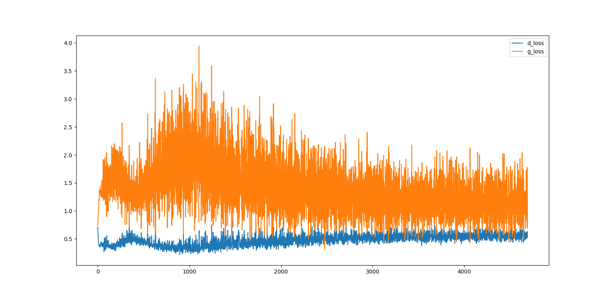
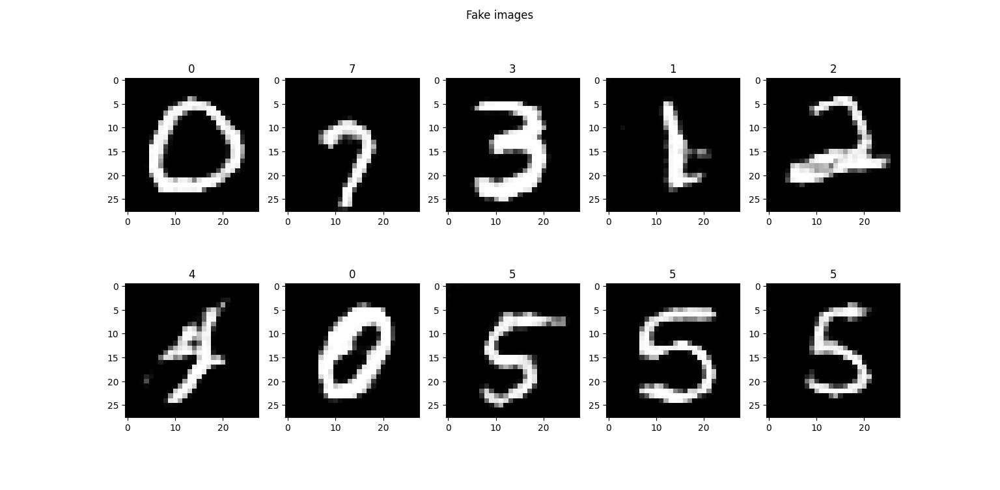

# Conditional deep convolutional generative adversarial network trained on FashionMNIST

## Contents

* **models.py**: the discriminator and generator classes
* **train_loop.py**: train step for cDCGAN training
* **train.py**: script for the training

## Results

Discriminator and generator losses:

Generated images:

