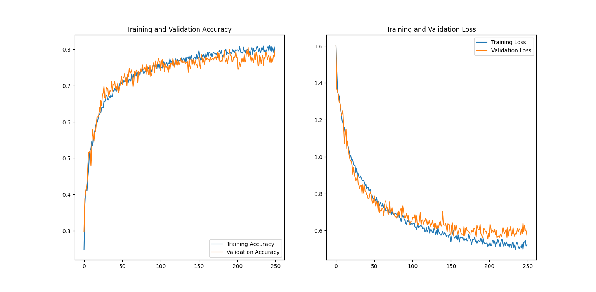
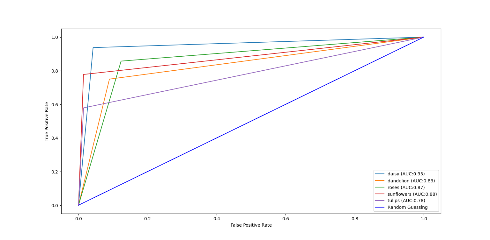
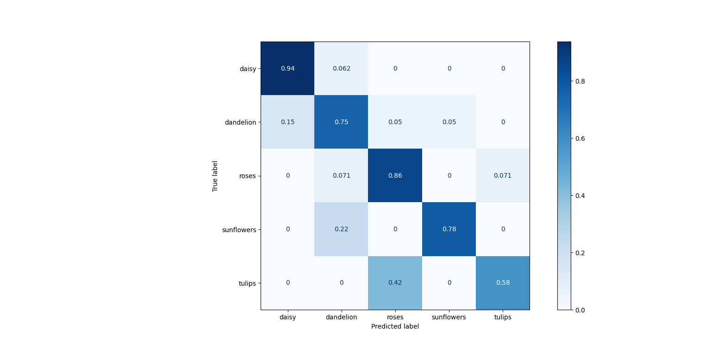
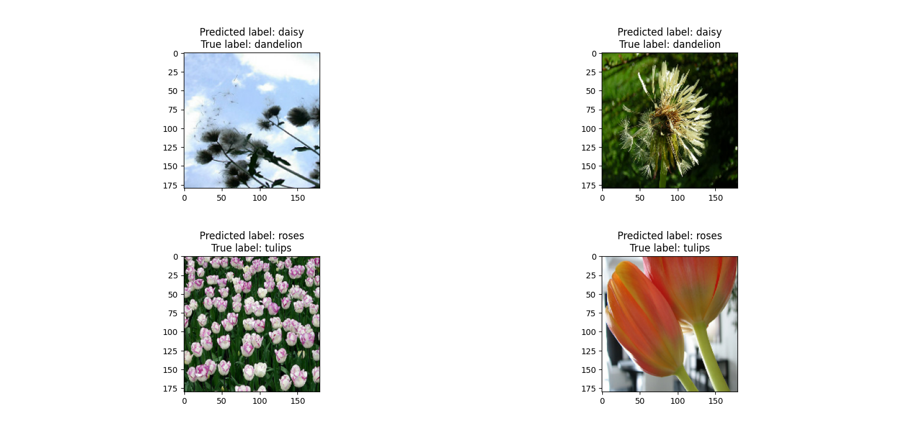
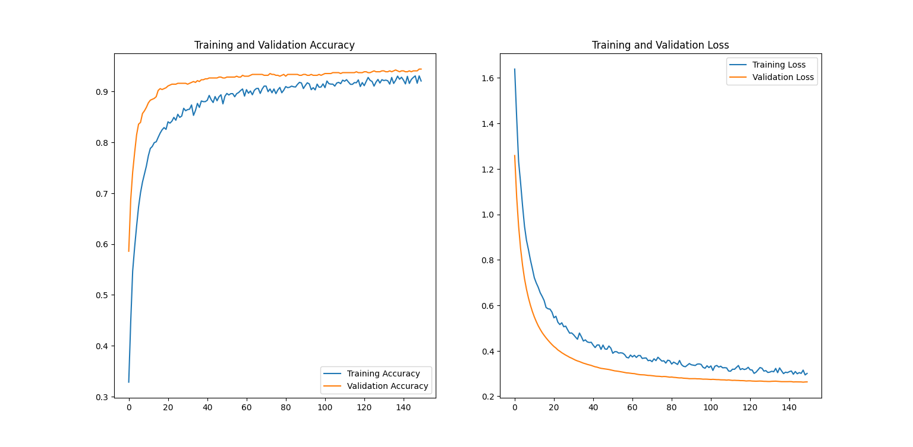
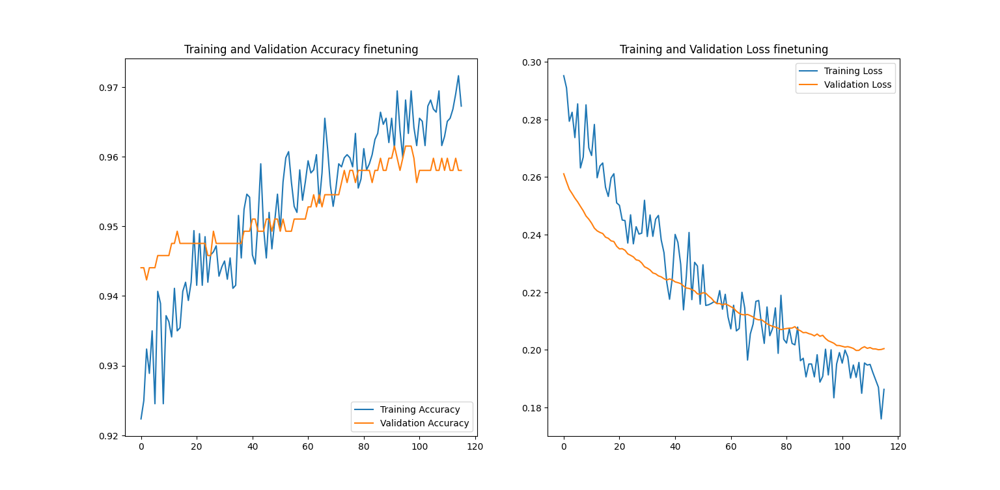
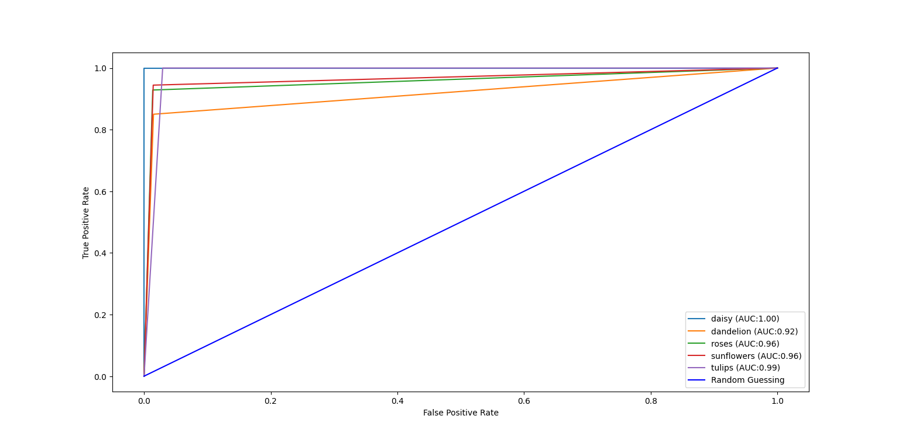
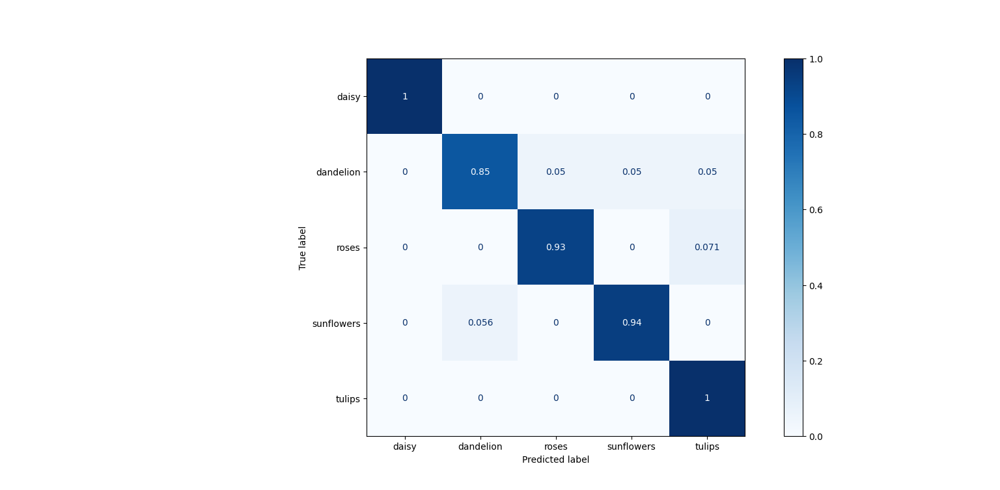
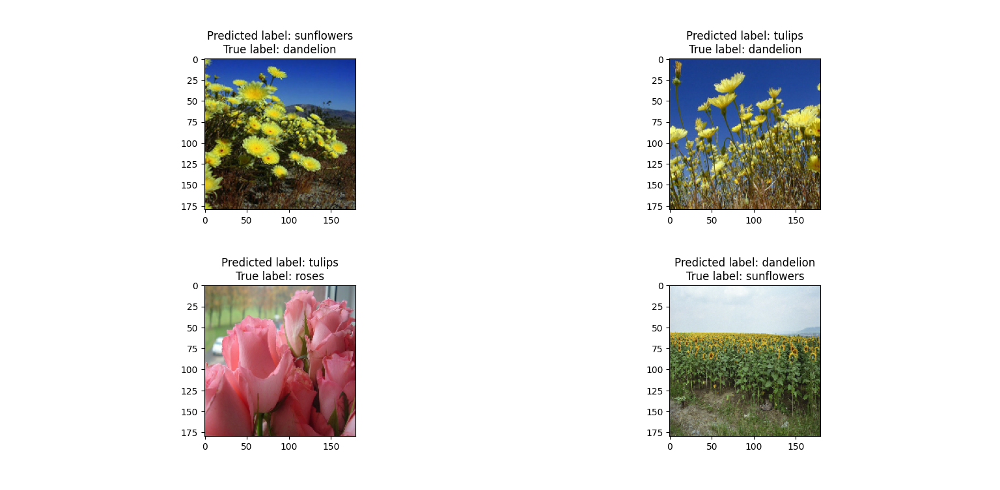

# Tutorial_CNN_tf

CNN trained on the tensorflow flowers dataset, the loss curves are related to training/validation while roc curves, confusion matrices and misclassified images refer to test time. 

-main.py is for searching a decent architecture, it creates a folder at each try with all the train logs (model.summay, hyperparameters used, train history etc)

-hyper_parameters_finetuning.py allows to train with a random search in order to find the best hyperparameters once decided the architecture

-test.py is for testing, it gives loss, accuracy and plots confusion matrix and multiclass roc curve

-transfer_learning.py build a classifier based on a pretrained net from keras.applications and comprare the result with the custom naive implementation

## The dataset

The tensorflow flowers dataset (https://www.tensorflow.org/datasets/catalog/tf_flowers) contains a lot of wrong images, a lot of which not even portraing flowers, for this project the dataset has been cleaned of the outliers

## Custom CNN

A standard architecture for a CNN, as one can see from the images it reaches around 85% accuracy in validation, decreasing to a not so great 77% at test time.

Training plot, confusion matrix and ROC curve are the following:

### Custom CNN loss curve

### Custom CNN ROC curve

### Custom CNN confusion matrix

### Misclassified images

As one can see it has difficuilties in differenciating between roses and tulips (not so easy even by first look, especially for pink ones) and with dandelions (that has a lot of intraclass variantions with both petal and seed-like flowers).

## Transfer learning (TL)

Using the pretrained EfficientNetB0 (https://arxiv.org/abs/1905.11946), the model has firstly been trained with all the layers but the last frozen, than it has been fine tuned unfreezing all the layers and retraining averything starting from the previous weights and with a very low learning rate for stability reasons.

The performance are obviously much better with 94% accuracy, 0.27 loss and 0.97 AUC score at test time.

### TL loss curve

#### Fine tuning loss curve

### TL ROC curve

### TL confusion matrix

### TL misclassified images

The superiority of this architecture is clear, in particular the generalizability of the model, the val acc is considerably closer to the test acc
with respect to the custom model.

Due to the kinda heavy regularizations (all the hyperparameters are listed in the tl model log folder) at the end of the model, the first loss plot has the val_loss slightly lower than the train_loss. 
This is not the case during fine tuning where the curves are decently overlapping (considering the small values of the loss functions) without much overfit (confirmed with the test acc close tothe val acc). The irregularity and step-like of the val acc during the finetuing is probably due to the small learning rate.

## ToDo

### Custom model

In order to improve the model one could look into the off diagonal term of the confusion matrix between roses and tulips with some ad-hoc data augmentation and explore a different architecture with batchnorm, bigger fully connected layers of deeper filters

### Transfer learning model

With some effort one could write a better pipeline where the regularization is applied during finetuning (looking at the firt loss plot of the tl model it is clear that regularizations is not needed), maybe allowing the use of a slightly greater learning rate and obtaining a smoother accuracy curve.

