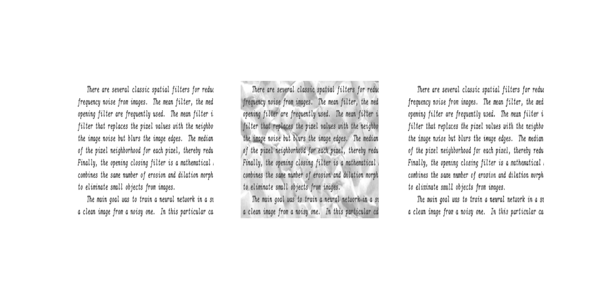

# Denoising autoencoder

Basic denoising autoencoder wrote following an (old) Kaggle competition https://www.kaggle.com/competitions/denoising-dirty-documents/data

It is trained on artificially 'dirtied' documents, below the loss plot (MAE = mean absolute error)

and a sample of the resulting images (ground truth/dirty image/reconstruction)

