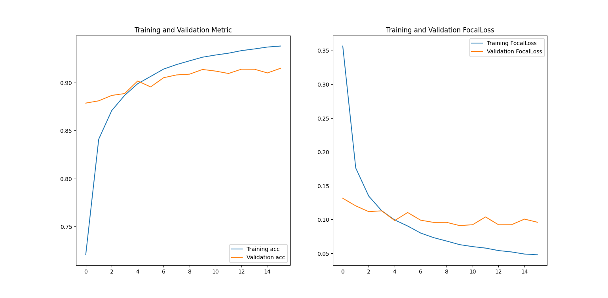
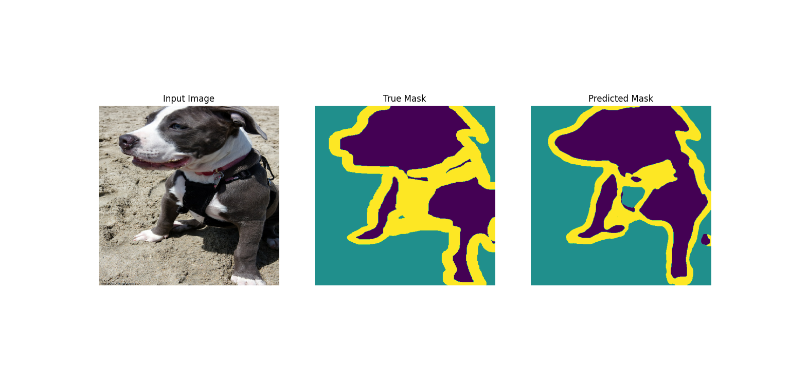

# Semantic segmentation tutorial
Segmentation model base on the encoder-decoder  architecture with the
DeepLabv3plus-resnet50 (https://arxiv.org/abs/1802.02611) from 
keras.applications model as the encoder. 

The dataset used is the OXFORD-pets

### Loss plot 

### Segmention test example 

## ToDo

It would be advisable to try a different metric more suitable for segmentation such as weighted IoU loss, in particular in order to get a neater border
